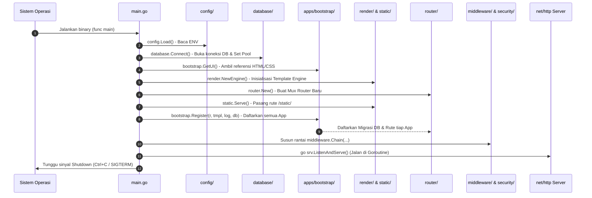

# Panduan Lengkap Alur Kerja & Arsitektur Go-AI (Untuk Pemula)

Selamat datang di **Go-AI Web Framework**! Dokumen ini dibuat khusus dengan penjelasan langkah demi langkah yang sangat detail agar siapa pun—baik pengembang (*developer*) pemula maupun agen AI—dapat memahami secara mendalam bagaimana framework ini bekerja dari saat server dinyalakan hingga memproses permintaan (*request*) pengguna.

---

## 💡 1. Analogi & Konsep Dasar (Mental Model)

Bayangkan **Go-AI Framework** sebagai sebuah **Restoran Modern**:

* **Core Framework (`main.go`, `config/`, `database/`, `middleware/`, dll)** adalah **Gedung, Sistem Kelistrikan, Dapur Utama, dan Satpam Restoran**. Bagian ini sudah dibangun kokoh, aman dari kebakaran, dan beroperasi otomatis.
* **Apps (`apps/`)** adalah **Menu Masakan dan Para Koki Khusus**. Di sinilah Anda (Developer/AI) bekerja memasak menu baru (fitur aplikasi) tanpa perlu merenovasi gedung restoran.
* **`apps/bootstrap/bootstrap.go`** adalah **Buku Menu Restoran**. Tempat di mana Anda mendaftarkan menu masakan baru agar pelanggan bisa memesannya.

---

## ⛔ 2. ATURAN EMAS (The Golden Rule)

> ⚠️ **ZONA AMAN WORKSPACE:**
> **Developer dan AI Agent HANYA BOLEH bekerja, membuat file, dan mengubah kode di dalam folder `/apps`.**

### Mengapa Aturan Ini Dibuat?
1. **Stabilitas Inti:** Folder di luar `/apps` adalah mesin inti (*Core Framework*). Mengubah isi Core dapat merusak sistem keamanan, *rate limiter*, hingga *graceful shutdown*.
2. **Pengembangan Paralel:** Dengan isolasi ini, puluhan fitur baru dapat dibuat di folder `/apps/nama_fitur` secara mandiri tanpa bentrok (*conflict*) antar-developer.
3. **Mekanisme Proposal untuk Core:** Jika Anda menemukan bug pada mesin inti atau membutuhkan fitur baru pada skala Core (seperti menambahkan *middleware* global baru), Anda **tidak boleh langsung mengedit file Core**. Anda harus membuat **Proposal / Issue** yang nantinya di-review dan diubah secara manual oleh **Tim Inti (Core Team) Go-AI**.

---

## 🗺️ 3. Peta Struktur Folder & Peran Setiap File

```text
go-ai/
│
├── [ ⛔ CORE FRAMEWORK - DILARANG DIESKEDIT DIREK ]
│   ├── main.go             ← Orkestrator utama server (Menyalakan mesin)
│   ├── config/config.go    ← Membaca Environment Variables (APP_ENV, PORT, DB_DSN)
│   ├── database/database.go← Mengatur Pool Koneksi SQLite & MySQL (WAL mode & PRAGMA)
│   ├── logger/logger.go    ← Logging terstruktur JSON via log/slog
│   ├── middleware/         ← Satpam HTTP:
│   │   ├── request_id.go   ← Memberi UUID unik untuk setiap request
│   │   ├── access_log.go   ← Mencatat log masuk/keluar HTTP
│   │   ├── recover.go      ← Anti-crash (Panic recovery)
│   │   ├── gzip.go         ← Kompresi otomatis data HTML/JSON
│   │   └── ratelimit.go    ← Anti-DDoS (Limit request per IP)
│   ├── router/router.go    ← Pembungkus http.ServeMux Go 1.22+
│   ├── security/security.go← Security Headers (HSTS, CSP, XSS) & CORS
│   ├── render/render.go    ← Renderer Template HTML & JSON
│   ├── static/static.go    ← Server file statis (CSS, JS, Gambar)
│   └── cache/cache.go      ← In-memory TTL Cache dengan auto-cleanup
│
└── [ ✅ ZONA KERJA DEVELOPER & AI AGENT ]
    ├── apps/bootstrap/     ← ⭐ Penghubung Utama Apps ke Core (bootstrap.go)
    ├── apps/ui/            ← Frontend (templates HTML + public CSS/JS + embed.go)
    ├── apps/dev/           ← Contoh App bawaan (testing API & WebSocket)
    └── apps/<nama_fitur>/  ← Folder fitur baru buatan Anda! (models.go & routes.go)
```

---

## 🚀 4. Alur Eksekusi Saat Server Menyala (Startup Lifecycle)

Ketika Anda menjalankan aplikasi melalui perintah:
```powershell
.\.build\win\go-ai.exe
```

Berikut adalah urutan kode yang dieksekusi oleh sistem komputer dari milidetik pertama hingga server siap:



### Penjelasan Detail Tiap Langkah Startup:

1. **Langkah 1: `main.go` Diinisialisasi**
   Fungsi `main()` di `main.go` dipanggil oleh OS. `main.go` bertindak sebagai *Orchestrator* (manajer) yang memanggil modul-modul lain.
2. **Langkah 2: Membaca Konfigurasi & Logger (`config/`, `logger/`)**
   Sistem membaca variabel lingkungan (`APP_ENV`, `APP_PORT`, `DB_DRIVER`, dll). Logger `slog` dinyalakan. Jika mode `production`, log berformat JSON terstruktur.
3. **Langkah 3: Menyiapkan Database (`database/database.go`)**
   Koneksi ke database (SQLite/MySQL) dibuka. Jika menggunakan SQLite, sistem otomatis memasang mode **WAL (*Write-Ahead Logging*)** dan `busy_timeout(5000)` agar database tidak terkunci saat banyak pengguna mengakses bersamaan.
4. **Langkah 4: Menghubungkan Aset UI (`apps/bootstrap/`)**
   `main.go` memanggil `bootstrap.GetUI()`. Di sini Core menerima lokasi template HTML dan file statis tanpa perlu tahu isi di dalamnya.
5. **Langkah 5: Membuat Router (`router/router.go`)**
   Router berbasis `http.ServeMux` Go 1.22+ dibuat untuk menampung rute URL aplikasi.
6. **Langkah 6: Registrasi Apps (`apps/bootstrap/bootstrap.go`)**
   `main.go` memanggil `bootstrap.Register(r, tmplEngine, log, db.DB)`. Fungsi ini akan memanggil setiap App di folder `/apps` (misal: `dev.RegisterRoutes(...)`). Di sinilah tabel database dibuat (*migration*) dan rute API/Web Anda dipasang.
7. **Langkah 7: Memasang Rantai Keamanan (Middleware)**
   Router dibungkus oleh *middleware* berlapis: `RequestID` -> `AccessLog` -> `Recover` -> `Gzip` -> `Headers` -> `CORS` -> `RateLimiter` (jika prod).
8. **Langkah 8: HTTP Server Listening & Graceful Shutdown**
   Server berjalan di *background goroutine* mendengarkan port (default `:8080`). `main.go` menangkap sinyal tombol `Ctrl+C`. Jika tombol ditekan, server diberi waktu 5 detik untuk menyelesaikan *request* aktif sebelum benar-benar berhenti.

---

## 🔄 5. Alur Eksekusi Saat Pengunjung Mengakses Web (HTTP Request Lifecycle)

Apa yang terjadi saat pengguna membuka URL `http://localhost:8080/api/hello` di browser?

```text
  [ Client / Browser ]
           │
           ▼ (1. Send HTTP GET /api/hello)
  ┌─────────────────────────────────────────────────────────────┐
  │ 🛡️  MIDDLEWARE LAYER (Core)                                │
  │ 1. RequestID  ➜ Beri ID unik (misal: req-xyz123)            │
  │ 2. AccessLog  ➜ Catat waktu mulai request                   │
  │ 3. Recover    ➜ Pasang jaring pengaman anti-crash           │
  │ 4. Gzip       ➜ Siapkan kompresi response                   │
  │ 5. Security   ➜ Injeksikan Header HSTS, CSP, XSS            │
  │ 6. CORS       ➜ Cek izin Domain                             │
  │ 7. RateLimit  ➜ Cek kuota request IP Client                 │
  └──────────────────────────────┬──────────────────────────────┘
                                 │ (2. Pass Request)
                                 ▼
  ┌─────────────────────────────────────────────────────────────┐
  │ 🚦 ROUTER LAYER (Core)                                      │
  │  Cari penanggung jawab rute "GET /api/hello"                │
  └──────────────────────────────┬──────────────────────────────┘
                                 │ (3. Panggil Handler)
                                 ▼
  ┌─────────────────────────────────────────────────────────────┐
  │ 📦 APP HANDLER LAYER (Developer Zone /apps/dev/routes.go)  │
  │  1. Jalankan kode handler buatan Anda                       │
  │  2. (Jika perlu) Panggil query ke database (models.go)      │
  │  3. Panggil render.JSON(...) atau tmplEngine.Render(...)    │
  └──────────────────────────────┬──────────────────────────────┘
                                 │ (4. Kirim Data Output)
                                 ▼
  ┌─────────────────────────────────────────────────────────────┐
  │ 🔀 MIDDLEWARE LAYER (Return Path)                            │
  │  - Kompresi isi data dengan Gzip                            │
  │  - Catat durasi waktu eksekusi di AccessLog                 │
  └──────────────────────────────┬──────────────────────────────┘
                                 │
                                 ▼ (5. HTTP Response 200 OK)
  [ Client / Browser Menerima JSON / HTML ]
```

---

## 🛠️ 6. Panduan Praktis Pemula: Cara Menambah Fitur Baru

Untuk membuat fitur baru (misalnya fitur **Products**), Anda **HANYA** perlu menyentuh folder `/apps`. Ikuti 3 langkah sederhana ini:

### Langkah 1: Buat Folder App Baru
Buat folder `apps/products/` dengan 2 file utama:
- `models.go` (Urusan database & data struct)
- `routes.go` (Urusan penanganan URL / HTTP)

### Langkah 2: Tulis `apps/products/models.go`
```go
package products

import (
	"context"
	"database/sql"
)

type Product struct {
	ID    int     `json:"id"`
	Name  string  `json:"name"`
	Price float64 `json:"price"`
}

// MigrateTable membuat tabel jika belum ada
func MigrateTable(db *sql.DB) error {
	_, err := db.Exec(`CREATE TABLE IF NOT EXISTS products (
		id INTEGER PRIMARY KEY AUTOINCREMENT,
		name TEXT NOT NULL,
		price REAL NOT NULL
	)`)
	return err
}

// GetAll mengambil semua data produk dari DB
func GetAll(ctx context.Context, db *sql.DB) ([]Product, error) {
	rows, err := db.QueryContext(ctx, "SELECT id, name, price FROM products")
	if err != nil {
		return nil, err
	}
	defer rows.Close()

	var list []Product
	for rows.Next() {
		var p Product
		if err := rows.Scan(&p.ID, &p.Name, &p.Price); err != nil {
			return nil, err
		}
		list = append(list, p)
	}
	return list, nil
}
```

### Langkah 3: Tulis `apps/products/routes.go`
```go
package products

import (
	"database/sql"
	"go-ai/logger"
	"go-ai/render"
	"go-ai/router"
	"net/http"
)

func RegisterRoutes(r *router.Router, tmplEngine *render.Engine, log logger.Logger, db *sql.DB) {
	// Endpoint API JSON
	r.Get("/api/products", func(w http.ResponseWriter, req *http.Request) {
		items, err := GetAll(req.Context(), db)
		if err != nil {
			log.Error("Gagal mengambil produk", "error", err)
			render.JSONError(w, http.StatusInternalServerError, "Gagal mengambil data")
			return
		}
		render.JSON(w, http.StatusOK, items)
	})
}
```

### Langkah 4: Daftarkan di `apps/bootstrap/bootstrap.go`
Buka file `apps/bootstrap/bootstrap.go` (satu-satunya file yang menghubungkan App Anda ke Core):

```go
import (
    // ... import lainnya
    "go-ai/apps/products" // 1. Import package produk Anda
)

func Register(r *router.Router, tmplEngine *render.Engine, log logger.Logger, db *sql.DB) {
    // 2. Jalankan migrasi tabel
    if err := products.MigrateTable(db); err != nil {
        log.Error("Gagal migrasi tabel products", "error", err)
    }

    // 3. Daftarkan rute
    dev.RegisterRoutes(r, tmplEngine, log, db)
    products.RegisterRoutes(r, tmplEngine, log, db) // <-- TAMBAHKAN BARIS INI
}
```

> ✨ **Selesai!** Jalankan ulang binary Anda, dan endpoint `/api/products` sudah langsung aktif lengkap dengan keamana *Rate Limiter*, *Panic Recovery*, dan *Security Headers*.

---

## 🙋‍♂️ 7. Bagaimana Jika Perlu Memodifikasi Core Framework?

Jika Anda (Developer atau AI Agent) menemukan kekurangan di Core Framework (misalnya butuh merubah cara kerja `render/` atau `middleware/`):

1. **JANGAN EDIT KODE CORE SECARA DIRECT!**
2. **Buat Dokumen Proposal / Issue:**
   - Jelaskan bagian Core mana yang ingin diubah.
   - Jelaskan alasan mengapa fitur di `/apps` tidak bisa menyelesaikan masalah tersebut.
   - Lampirkan contoh usulan perubahan kode (*diff*).
3. **Review Manual:** Tim Inti Go-AI akan mengevaluasi proposal tersebut demi menjaga standar keandalan *production grade*.

---

## ❓ 8. FAQ Pemula

* **Q: Kenapa tidak disarankan menggunakan `go run main.go` untuk testing?**
  *A: Di Windows, perintah `go run` membuat file temporary binary baru di lokasi acak setiap kali dijalankan. Hal ini menyebabkan Windows Firewall selalu meminta konfirmasi izin (*pop-up*) berulang kali. Gunakan kompilasi binary ke `.build\win\go-ai.exe` lalu jalankan binary tersebut.*
* **Q: Bagaimana cara mengganti database dari SQLite ke MySQL?**
  *A: Cukup ubah Environment Variables saat menjalankan aplikasi tanpa merubah kode:*
  ```bash
  $env:DB_DRIVER="mysql"
  $env:DB_DSN="user:password@tcp(127.0.0.1:3306)/dbname?parseTime=true"
  ```
* **Q: Di mana saya harus meletakkan template HTML dan file CSS?**
  *A: Template HTML diletakkan di `apps/ui/templates/`, sedangkan file CSS/JS/Gambar diletakkan di `apps/ui/public/`.*
